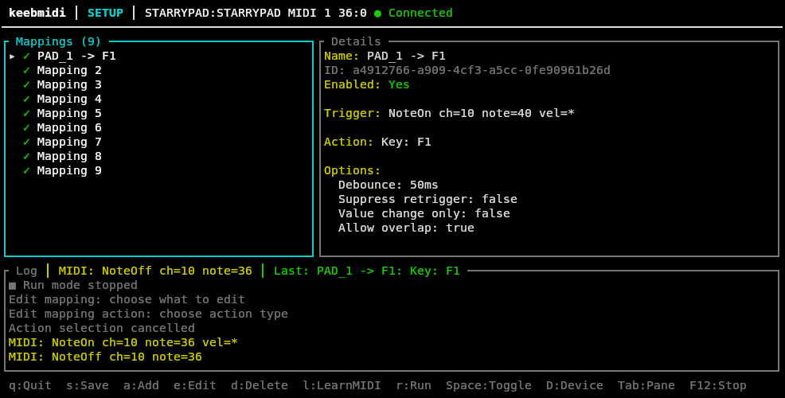

# 🎹 keebmidi

**Map MIDI inputs to keyboard keys and macros — right from your terminal.**

keebmidi is a terminal UI (TUI) application written in Rust that lets you turn any MIDI controller into a keyboard macro pad. Connect a MIDI device, learn its inputs, assign keyboard actions, and run — all without leaving the terminal.

---

## ✨ Features

- **🎛️ MIDI Device Discovery** — Automatically enumerate and connect to available MIDI input devices.
- **📡 Learn Mode** — Intuitive "learn" workflow: press a pad/key/knob on your MIDI controller and keebmidi captures the event as a trigger.
- **⌨️ Flexible Output Actions**
  - Single key tap
  - Key chords (e.g. `Ctrl+Shift+P`)
  - Text entry
  - Recorded macros (key sequences with timing)
- **🔁 Macro Recording & Playback** — Record complex key sequences with delays, then replay them on demand with configurable playback modes.
- **💾 TOML Configuration** — Human-readable, version-controlled config files you can edit by hand.
- **🖥️ Beautiful TUI** — Clean, keyboard-driven interface built with [ratatui](https://ratatui.rs/) and [crossterm](https://docs.rs/crossterm/).
- **🔒 Safe by Design** — No shell execution, explicit run/edit modes, and optional panic-button hotkey to instantly suspend all mappings.

---

## 📸 Quick Overview



---

## 🚀 Getting Started

### Prerequisites

- **Rust** 2024 edition (1.85+)
- A connected **MIDI input device**
- **Linux**: ALSA development libraries (`libasound2-dev` on Debian/Ubuntu)

### Build & Run

```bash
# Clone the repository
cd keebmidi

# Build in release mode
cargo build --release

# Run
cargo run --release
```

### CLI Options

```
keebmidi [OPTIONS]

Options:
  --config <PATH>          Path to config file (default: ~/.config/keebmidi/config.toml)
  --device <NAME>          Auto-select a MIDI device by name
  --run                    Start directly in run mode
  --no-run                 Start in setup/edit mode (default)
  --verbose                Enable verbose logging
  --dump-default-config    Print a default config to stdout and exit
  -h, --help               Print help
  -V, --version            Print version
```

---

## 🎮 Usage

### Core Workflow

1. **Launch** keebmidi.
2. **Select** a MIDI input device from the detected list.
3. **Add a mapping** (`a`):
   - Press `l` to **learn a MIDI trigger** — hit a pad, key, or twist a knob.
   - Press `k` to **learn a keyboard action** — press your desired key or chord.
   - Or press `m` to **record a macro** — perform a sequence of keystrokes.
4. **Save** your config (`s`).
5. **Switch to Run mode** (`r`) — incoming MIDI events now trigger keyboard output!

### Keybindings

| Key     | Action                        |
|---------|-------------------------------|
| `q`     | Quit                          |
| `s`     | Save config                   |
| `a`     | Add new mapping               |
| `e`     | Edit selected mapping         |
| `d`     | Delete selected mapping       |
| `l`     | Learn MIDI trigger            |
| `k`     | Learn key / chord             |
| `m`     | Record macro                  |
| `r`     | Toggle Run mode               |
| `Space` | Enable / disable mapping      |
| `Tab`   | Switch pane                   |
| `Esc`   | Cancel current action         |

---

## ⚙️ Configuration

Mappings are stored in TOML format. The default config location follows XDG conventions:

- **Linux / macOS**: `~/.config/keebmidi/config.toml`
- **Windows**: `%APPDATA%\keebmidi\config.toml`

### Example Config

```toml
version = 1
selected_device = "MPK mini IV"

[[mappings]]
id = "map_01"
name = "Kick Pad -> Space"
enabled = true

[mappings.trigger]
type = "note_on"
channel = 1
note = 36

[mappings.action]
type = "key_tap"
key = "Space"

[mappings.options]
debounce_ms = 50
suppress_retrigger_while_held = true
trigger_on_value_change_only = false
allow_overlap = true

[[mappings]]
id = "map_02"
name = "Pedal -> Ctrl+Shift+P"
enabled = true

[mappings.trigger]
type = "cc"
channel = 1
controller = 64
min_value = 1
max_value = 127

[mappings.action]
type = "key_chord"
keys = ["Ctrl", "Shift", "P"]

[mappings.options]
debounce_ms = 100
trigger_on_value_change_only = true
```

---

## 🏗️ Architecture

keebmidi uses a **single UI thread** with **message-passing** from background producers to keep the interface responsive.

```
┌──────────────┐     ┌──────────────────┐     ┌──────────────────┐
│  MIDI Input  │────▶│   Event Channel  │────▶│   UI / Event     │
│  Manager     │     │  (crossbeam)     │     │   Loop           │
└──────────────┘     └──────────────────┘     └────────┬─────────┘
                                                       │
                                              ┌────────▼─────────┐
                                              │  Mapping Engine  │
                                              │  (match + route) │
                                              └────────┬─────────┘
                                                       │
                                              ┌────────▼─────────┐
                                              │  Action Executor │
                                              │  (enigo backend) │
                                              └──────────────────┘
```

### Module Structure

```
src/
  main.rs              — Entry point, CLI parsing, app loop
  app/                 — Application state, events, and reducer logic
  ui/                  — TUI rendering with ratatui
    components/        — Individual UI widgets (mapping list, details, modals, status bar)
  midi/                — MIDI device management, decoding, and trigger matching
  input/               — Terminal input handling and key capture
  actions/             — Action execution, keyboard output, macro runner
  config/              — TOML config model, loading, and saving
  platform/            — Platform capability detection
  errors.rs            — Typed error definitions
```

---

## 📦 Dependencies

| Crate                | Purpose                                |
|----------------------|----------------------------------------|
| `ratatui`            | Terminal UI framework                  |
| `crossterm`          | Terminal backend & keyboard events     |
| `midir`              | MIDI device enumeration & input        |
| `enigo`              | Keyboard event simulation              |
| `clap`               | CLI argument parsing                   |
| `serde` + `toml`     | Config serialization                   |
| `thiserror` + `anyhow` | Error handling                      |
| `crossbeam-channel`  | Thread-safe event passing              |
| `tracing`            | Structured logging                     |
| `uuid`               | Unique mapping identifiers             |

---

## 🐧 Platform Notes

- **Linux**: Requires ALSA for MIDI. The `enigo` keyboard backend supports both X11 (via `xdo`) and Wayland. Some key combinations may behave differently depending on your display server.
- **macOS**: Should work out of the box via CoreMIDI and the native accessibility API (requires permissions for keyboard simulation).
- **Windows**: Supported via the Windows MIDI API and `SendInput`.

> ⚠️ **Note**: Terminal-based key capture has inherent limitations — some key combinations may be intercepted by the OS or terminal emulator before reaching keebmidi. A manual key selection fallback is provided in the UI for these cases.

---

## 📄 License

This project is open source. See the [LICENSE](LICENSE) file for details.

---

<p align="center">
  <strong>keebmidi</strong> — turn any MIDI controller into a keyboard macro pad 🎹⌨️
</p>
